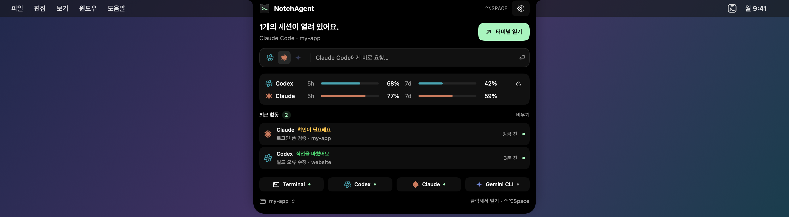
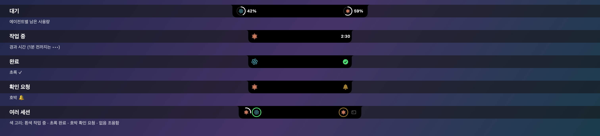
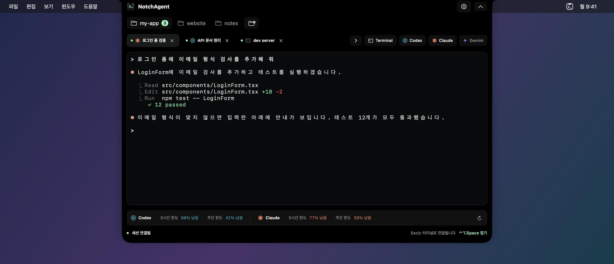

# NotchAgent

[English](README.md) · **한국어**

**맥북 노치에서 여는 터미널과 AI 코딩 에이전트 작업 공간.**

NotchAgent는 메뉴바 중앙의 카메라 노치에 붙어 사는 macOS 앱입니다. 노치에 마우스를 올리면 미리보기가, 클릭하거나 `⌃⌥Space`를 누르면 큰 터미널이 그 자리에서 펼쳐집니다. Codex, Claude Code, Gemini CLI 같은 에이전트를 평소 설정 그대로 실행하고, 접어 두어도 작업은 계속됩니다.



_앱 UI에 샘플 데이터를 넣어 렌더링한 화면입니다._

## 주요 기능

- **노치에 붙는 작업 공간**: 실제 노치 위치에 정렬되며, 메뉴바 높이부터 내용을 쓰되 카메라가 있는 가운데만 비워 둡니다. 노치가 없는 화면에서는 상단 중앙에 가상 노치를 표시합니다. 펼치고 접는 동작은 다이내믹 아일랜드처럼 부드럽게 움직입니다.
- **네이티브 터미널**: [SwiftTerm](https://github.com/migueldeicaza/SwiftTerm) 기반. 256색·트루컬러, TUI, 5,000줄 스크롤백, 한글 입력기 조합, `⌘`+클릭으로 링크 열기, `⌘F` 검색을 지원합니다.
- **에이전트 실행**: Terminal, Codex, Claude Code, Gemini CLI를 한 번에 시작합니다. 최대 8개 세션을 동시에 유지하며, 노치를 접어도 세션은 계속 실행됩니다.
- **알아보기 쉬운 탭**: CLI가 보내는 작업 제목을 표시합니다. 탭을 더블클릭하거나 우클릭해 직접 이름을 정할 수 있으며, 이름은 세션과 함께 복원됩니다.
- **파일·폴더 끌어놓기**: 터미널에 파일이나 이미지를 놓으면 경로만 입력됩니다. 노치나 미리보기, 큰 화면 상단에 폴더를 놓으면 작업 폴더로 추가하고 바로 전환합니다.
- **노치 알림과 실시간 표시**: 접힌 노치는 글자 없이 약속된 기호로만 상태를 보여 줍니다. 세션이 없으면 양쪽에 에이전트별 남은 사용량(흰 게이지, 20% 이하면 빨강)을 보여 주고(사용량 표시를 끄면 노치만 보입니다), 세션이 하나면 왼쪽에 에이전트 아이콘, 오른쪽에 상태 기호(작업 중 `•••`·1분 뒤 경과 시간, 완료 초록 ✓, 확인 요청 호박 🔔, 오류 종료 빨강 ✕, 한도 부족 게이지)가 나옵니다. 세션이 여러 개면 노치 양쪽에 아이콘을 나눠 놓고 둘레의 색 고리(흰색 회전 = 작업 중, 초록 = 완료, 호박 = 확인 요청, 빨강 = 오류, 고리 없음 = 조용함)로 알려 줍니다. 보고 있지 않은 세션이 일을 마치거나 확인을 요청하면 다이내믹 아일랜드처럼 노치 아래에 잠깐 알려 줍니다. Claude Code와 Codex는 각 CLI의 공식 신호(Claude 훅, Codex `notify`)로 정확히 알리고, 그 밖의 세션은 출력 흐름으로 판단합니다.

  

- **바로 요청**: 미리보기에서 에이전트를 고르고 입력하면 현재 폴더에서 그 요청으로 세션이 시작됩니다. 세션 한도·CLI 경로·폴더 문제로 시작하지 못하면 입력한 요청을 그대로 남깁니다.
- **최근 활동**: 미리보기의 한 줄 사용량 아래에 놓친 작업 완료·확인 요청·세션 종료를 모아 봅니다. 눌러 열린 세션으로 이동할 수 있고, 최근 24시간의 활동을 재실행 후에도 확인할 수 있습니다. macOS 알림 센터와 짧은 소리는 선택 기능이며, 알림 제목·폴더는 기본적으로 숨깁니다.
- **여러 작업 폴더**: 폴더 칩으로 프로젝트를 전환합니다. 각 칩에 실행 중인 세션 수가 표시되고, 우클릭으로 새 세션 열기·Finder에서 보기·제거를 할 수 있습니다. 미리보기 왼쪽 아래의 폴더 이름으로도 전환할 수 있습니다.
- **git worktree**: 저장소 칩에서 새 브랜치의 worktree를 만들어, 여러 에이전트가 서로의 파일을 건드리지 않고 동시에 작업합니다. 제거할 때 커밋하지 않은 변경은 절대 지우지 않습니다.
- **세션 이어가기**: 앱을 다시 열면 탭이 복원되고, Claude Code와 Codex는 탭마다 원래 대화를 정확히 이어 엽니다.
- **구독 사용량 표시** (선택): Codex와 Claude Code의 5시간·주간 남은 한도를 에이전트별 색으로 보여 줍니다.
- **내 취향대로**: 단축키, 강조색, 터미널 테마·글꼴, 한국어/English, 큰 화면 크기(작게·기본·크게), 다른 앱으로 이동할 때 자동 접기를 설정에서 바꿀 수 있습니다.
- **가벼운 상주 앱**: Dock 아이콘 없이 메뉴바에 상주하며, 분석·텔레메트리·계정이 없습니다.

### 작업 화면



_앱 UI에 샘플 데이터를 넣어 렌더링한 화면입니다._

## 요구 사항

- **Apple Silicon Mac**, macOS 14 이상 (Intel Mac은 지원하지 않습니다)
- 사용할 CLI는 각자 설치하고 로그인해 두어야 합니다 (`codex`, `claude`, `gemini`)

## 설치

### 릴리스에서 받기

[Releases](../../releases)에서 최신 DMG를 받아 `NotchAgent.app`을 응용 프로그램 폴더로 옮긴 뒤 실행하세요.

### 소스에서 빌드

Xcode 16 이상이 필요합니다. 의존성은 저장소에 포함되어 있어 네트워크 없이 빌드됩니다.

```sh
git clone <this-repo>
cd NotchAgents
bash Scripts/build.sh      # Release 빌드
bash Scripts/test.sh       # 테스트
bash Scripts/package.sh    # Dist/ 에 앱과 ZIP 생성 (로컬 ad-hoc 서명)
```

또는 `NotchAgent.xcodeproj`를 열고 **NotchAgent** 스킴 → **My Mac** → Run.

빌드 캐시는 `/private/tmp/NotchAgent-build-<uid>`에 둡니다(`NOTCHAGENT_BUILD_DIR`로 변경). iCloud로 동기화되는 폴더의 파일 속성이 코드 서명을 방해하는 문제를 피하기 위해서입니다.

## 사용법

| 동작 | 방법 |
|---|---|
| 미리보기 | 노치에 마우스 올리기 (반응 속도는 설정에서 조절) |
| 작업 화면 열기 / 접기 | 노치 클릭, `⌃⌥Space`(설정에서 변경), 메뉴바 아이콘. 확인이 필요한 세션이 있으면 그 세션을 먼저 엽니다. 접어도 세션은 계속 실행됩니다 |
| 바로 요청 | 미리보기의 입력 줄을 클릭해 입력 후 `↩` (`Esc`로 취소) |
| 새 세션 | 세션 탭 줄 오른쪽의 에이전트 버튼 (`›` / `+`로 접고 펼치기) |
| 세션 종료 | 탭의 `×` 또는 셸에서 `exit` |
| 탭 이름 변경 | 탭 더블클릭 또는 우클릭 → 이름 변경. 비우거나 **터미널 제목 사용**을 선택하면 자동 제목으로 돌아갑니다 |
| 파일·이미지 전달 | 터미널 안에 끌어놓기. 경로가 입력되며 `↩`는 직접 눌러 제출합니다 |
| 폴더 끌어놓기 | 접힌 노치·미리보기·큰 화면 맨 위에 놓으면 폴더 추가 후 전환. 터미널 안에 놓으면 폴더 경로만 입력됩니다 |
| 놓친 알림 확인 | 미리보기 → 최근 활동. 항목을 누르면 해당 폴더와 세션으로 이동합니다 |
| 확인 필요한 세션으로 이동 | 접힌 노치 클릭·전역 열기 단축키·미리보기의 **확인 필요** 버튼. 큰 화면에서는 `⇧⌘A` |
| 큰 화면 크기 | 설정 → 노치 → 큰 화면 크기: 작게(760×500), 기본(940×620), 크게(1180×760). 화면에 맞게 제한됩니다 |
| 다른 앱을 클릭할 때 접기 | 설정 → 노치 → 다른 앱을 클릭하면 자동으로 접기 |
| 작업 폴더 추가 / 관리 | 폴더 칩 오른쪽 버튼 / 칩 우클릭 (worktree 만들기·제거 포함) |
| 순서 바꾸기 | 세션 탭이나 폴더 칩을 끌어서 놓기 |
| 탭 이동 | `⌘1`–`⌘8`, 다음/이전 탭 `⇧⌘]` / `⇧⌘[` |
| 같은 종류의 새 세션 | `⌘T` |
| 터미널 검색 | `⌘F` (다음 `⌘G`, 이전 `⇧⌘G`) |
| 링크 열기 | `⌘`를 누른 채 URL 클릭 |

- `Esc`, `⌃C`, `⌘W`는 CLI로 그대로 전달됩니다.
- 탭이 넘치면 가로로 스크롤되며(마우스 휠 가능), 선택한 탭으로 자동 이동합니다.
- CLI를 찾지 못하면 설정에서 실행 파일의 절대 경로를 지정하세요.
- 세션을 닫거나 앱을 종료할 때는 실행 중인 에이전트(입력 대기 중 포함) 또는 명령을 실행 중인 셸이 있으면 확인을 묻습니다. 제출하지 않은 입력은 복원되지 않지만, 대화 기록은 각 CLI에 남아 `/resume`이나 다음 실행 시 이어 갈 수 있습니다.
- 최근 활동은 최대 50개를 로컬에 24시간 보관합니다. 설정 → 활동 알림에서 보관을 끄면 저장본을 즉시 삭제합니다. 종료·재실행 후 세션 ID가 바뀐 기록은 누르면 읽음 처리되며, 이전 세션 자체는 다시 열리지 않습니다.
- 알림 센터·소리는 설정 → 활동 알림에서 각각 켭니다(기본 꺼짐). 완료·확인 요청·세션 종료 중 알릴 종류도 선택할 수 있습니다. macOS 알림의 작업 제목·폴더는 기본적으로 숨기며, 설정에서 표시할 수 있습니다. 알림 센터는 처음 켤 때 macOS 권한을 요청하며, 집중 모드와 시스템 알림 설정의 영향을 받습니다.
- Finder의 이미지 파일은 원래 경로를 사용합니다. 스크린샷 미리보기 등 파일 경로가 없는 이미지는 임시 폴더 `NotchAgent-Drops`에 받아 해당 경로를 입력합니다. 클립보드는 바꾸지 않습니다.

### 사용량 표시

설정에서 켤 수 있으며, 기존 CLI 로그인을 그대로 사용합니다. NotchAgent가 API 키나 로그인 정보를 다루지 않습니다.

- **Codex**: 5분마다 로컬 `codex app-server`에 읽기 전용으로 한도를 조회합니다.
- **Claude Code**: Claude Code가 상태 표시줄로 알려 주는 공식 한도 값을 사용합니다(Pro/Max). NotchAgent에서 연 Claude 세션이 응답할 때 갱신되며, 기존 상태 표시줄 설정은 그대로 동작합니다.

## 개인정보

- 분석 서버, 텔레메트리, 터미널 기록 저장이 없습니다.
- 작업 폴더 목록과 설정, 세션 복원 정보(탭 이름·작업 제목 포함), 최근 24시간의 활동 메타데이터를 macOS 환경설정에 로컬로 저장합니다. 최근 활동 보관은 끌 수 있습니다.
- 알림 센터를 켜면 에이전트 종류와 이벤트만 macOS 알림으로 표시됩니다. 작업 제목·폴더는 별도로 상세 내용 표시를 켠 경우에만 포함됩니다.
- 셸 실행을 위해 App Sandbox를 사용하지 않으며, 실행한 명령은 사용자 권한으로 동작합니다. 원격 프로그램이 클립보드를 덮어쓰는 기능(OSC 52)은 차단합니다.
- 손쉬운 사용·화면 기록 권한을 요구하지 않고, 키체인이나 로그인 정보를 읽지 않습니다.
- 알림과 대화 이어가기를 위한 Claude 훅·Codex `notify`는 NotchAgent에서 연 세션에만 적용되며, 이벤트 종류와 대화 ID만 로컬에서 사용합니다. 기존 Codex `notify` 명령은 함께 실행합니다. 해석할 수 없는 형식의 `notify` 설정은 덮어쓰지 않으므로 기존 명령은 유지되지만, 해당 세션의 정확한 Codex 완료 알림은 사용하지 못할 수 있습니다.

자세한 내용은 [PRIVACY.md](PRIVACY.md)를 참고하세요.

## 문의

버그 신고와 제안은 GitHub Issues로, 그 밖의 문의는 june295921@gmail.com 으로 보내 주세요.

## 문제 해결

- **Dock에 아이콘이 없어요**: 정상입니다. 노치나 메뉴바 오른쪽의 터미널 아이콘을 사용하세요.
- **노치에 안 붙어요**: 설정 → 표시 화면을 **내장 노치 화면 우선**으로 두고, 내장 디스플레이가 켜져 있는지 확인하세요.
- **노치 UI가 겹쳐요**: 다른 노치 앱을 잠시 종료하세요. NotchAgent는 두 번째 실행을 자동으로 막습니다.
- **단축키가 안 먹어요**: 다른 앱의 단축키와 충돌할 수 있습니다. 노치 클릭이나 메뉴바 아이콘으로 여세요.
- **버그 신고**: 아래 명령의 진단 로그를 함께 보내 주세요. 오류 종류만 기록하며 터미널 내용·경로·계정 정보는 남기지 않습니다.

  ```sh
  log show --last 1h --info --predicate 'subsystem == "app.notchagent.desktop"'
  ```

## 프로젝트 구조

```
Sources/     앱 코드 (노치 창·화면·터미널 세션·에이전트 신호·사용량·작업 폴더)
Tests/       단위·PTY 통합·UI 렌더링 테스트
Scripts/     빌드·테스트·패키징·배포(서명·공증) 스크립트
Resources/   Info.plist, 아이콘, 제3자 라이선스
Vendor/      고정 버전 SwiftTerm 소스
docs/images/ README 이미지 (Scripts/readme-images.sh로 샘플 데이터에서 다시 생성)
```

## 라이선스

NotchAgent의 라이선스는 아직 정해지지 않았습니다. 포함된 제3자 코드는 [THIRD-PARTY-NOTICES.md](THIRD-PARTY-NOTICES.md)를 참고하세요.

에이전트 이름(Codex, Claude Code, Gemini CLI)은 외부 프로그램을 식별하기 위한 것이며 제휴나 보증을 의미하지 않습니다.
