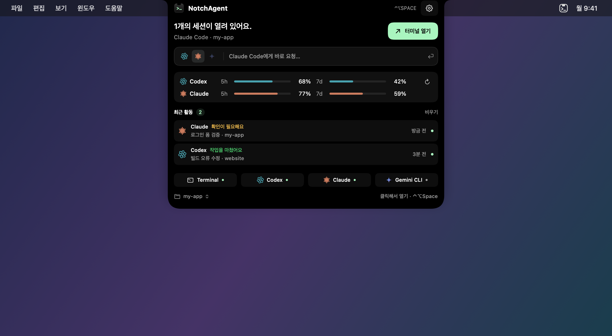
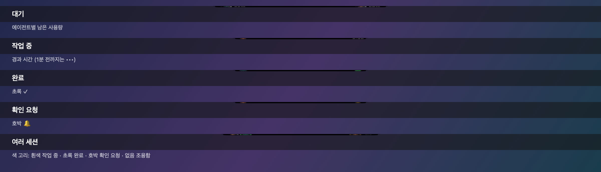
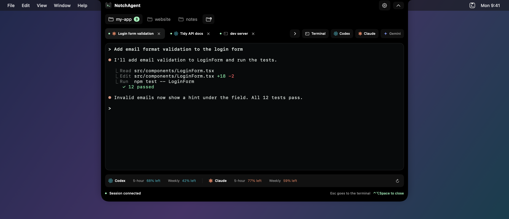

# NotchAgent

**English** · [한국어](README.ko.md)

**A terminal and AI coding agent workspace that opens from your MacBook's notch.**

NotchAgent is a macOS app that lives in the camera notch at the top center of the menu bar. Hover over the notch for a preview; click it or press `⌃⌥Space` and a full terminal unfolds right there. Run agents like Codex, Claude Code, and Gemini CLI with your usual setup, and they keep working while the notch is collapsed.



_Rendered from the app's UI with sample data._

## Features

- **A workspace attached to the notch**: Aligns to the real notch, uses the menu bar's height, and leaves only the camera area empty. On displays without a notch, it shows a virtual notch at the top center. Expanding and collapsing animate smoothly, like the Dynamic Island.
- **Native terminal**: Built on [SwiftTerm](https://github.com/migueldeicaza/SwiftTerm). Supports 256 colors and true color, TUIs, 5,000 lines of scrollback, input method composition (e.g. Korean), `⌘`-click to open links, and `⌘F` search.
- **Agent launcher**: Start Terminal, Codex, Claude Code, or Gemini CLI in one click. Keeps up to 8 sessions at once, and sessions keep running when the notch is collapsed.
- **Readable tabs**: Shows the task title each CLI reports. Double-click or right-click a tab to name it yourself; names are restored with the session.
- **Drag and drop files and folders**: Drop a file or image into the terminal to insert its path. Drop a folder on the notch, the preview, or the top of the expanded view to add it as a work folder and switch to it.
- **Live status in the notch**: The collapsed notch shows status with symbols only, no text. With no sessions, each side shows an agent's remaining quota (a white gauge that turns red at 20% or less; with usage display off, only the notch shows). With one session, the agent icon sits on the left and a status symbol on the right (working `•••`, then elapsed time after a minute; finished green ✓; needs you amber 🔔; exited with an error red ✕; low-quota gauge). With several sessions, icons are split across both sides with a colored ring around each (spinning white = working, green = finished, amber = needs you, red = error, no ring = quiet). When a session you aren't looking at finishes or asks for input, a short notice drops below the notch, Dynamic Island style. Claude Code and Codex report precisely through each CLI's official signals (Claude hooks, Codex `notify`); other sessions are judged by their output.

  

- **Quick ask**: Pick an agent in the preview, type a request, and a session starts in the current folder with that request. If it can't start (session limit, CLI path, or folder issue), your text is kept.
- **Recent activity**: Below the one-line usage in the preview, see missed completions, requests for input, and ended sessions. Click one to jump to its session; activity from the last 24 hours survives relaunches. macOS Notification Center and a short sound are optional, and notification titles and folders are hidden by default.
- **Multiple work folders**: Switch projects with folder chips. Each chip shows its running session count; right-click to open a new session, show in Finder, or remove. You can also switch from the folder name at the bottom left of the preview.
- **git worktree**: Create a worktree on a new branch from a repository chip, so several agents can work at once without touching each other's files. Removing one never deletes uncommitted changes.
- **Resume sessions**: Reopening the app restores your tabs, and Claude Code and Codex reopen each tab's exact conversation.
- **Subscription usage** (optional): Shows the remaining 5-hour and weekly quota for Codex and Claude Code in each agent's color.
- **Make it yours**: Change the shortcut, accent color, terminal theme and font, language (Korean/English), terminal size (Small, Default, Large), and auto-collapse when switching apps in Settings.
- **Light and unobtrusive**: Lives in the menu bar with no Dock icon. No analytics, telemetry, or accounts.

### Workspace



_Rendered from the app's UI with sample data._

## Requirements

- **Apple silicon Mac** with macOS 14 or later (Intel Macs are not supported)
- Install and sign in to the CLIs you want to use (`codex`, `claude`, `gemini`)

## Install

### From a release

Download the latest DMG from [Releases](../../releases), move `NotchAgent.app` to your Applications folder, and open it.

### Build from source

Requires Xcode 16 or later. Dependencies are vendored, so it builds without a network connection.

```sh
git clone <this-repo>
cd NotchAgents
bash Scripts/build.sh      # Release build
bash Scripts/test.sh       # Tests
bash Scripts/package.sh    # App and ZIP in Dist/ (local ad-hoc signature)
```

Or open `NotchAgent.xcodeproj`, choose the **NotchAgent** scheme → **My Mac**, and Run.

The build cache lives in `/private/tmp/NotchAgent-build-<uid>` (change it with `NOTCHAGENT_BUILD_DIR`). This avoids iCloud-synced folders, whose file attributes can break code signing.

## Usage

| Action | How |
|---|---|
| Preview | Hover over the notch (adjust the delay in Settings) |
| Open / collapse the workspace | Click the notch, press `⌃⌥Space` (changeable in Settings), or use the menu bar icon. A session that needs you opens first. Sessions keep running when collapsed |
| Quick ask | Click the input line in the preview, type, and press `↩` (`Esc` to cancel) |
| New session | Agent buttons at the right of the tab bar (fold or unfold them with `›` / `+`) |
| End a session | The tab's `×`, or `exit` in the shell |
| Rename a tab | Double-click the tab, or right-click → **Rename…**. Leave it empty or choose **Use Terminal Title** to go back to the automatic title |
| Pass a file or image | Drop it into the terminal. Its path is inserted; press `↩` yourself to submit |
| Drop a folder | Drop it on the collapsed notch, the preview, or the top of the expanded view to add it and switch. Dropped inside the terminal, only the path is inserted |
| Catch up on missed events | Preview → **Recent Activity**. Click an entry to go to its folder and session |
| Go to a session that needs you | Click the collapsed notch, use the global open shortcut, or the preview's **Needs attention** button. `⇧⌘A` in the expanded view |
| Terminal size | Settings → **Notch** → **Terminal size**: Small (760×500), Default (940×620), Large (1180×760). Limited to fit the screen |
| Collapse when clicking another app | Settings → **Notch** → **Collapse when switching to another app** |
| Add / manage work folders | The button to the right of the folder chips / right-click a chip (including creating and removing worktrees) |
| Reorder | Drag session tabs or folder chips |
| Switch tabs | `⌘1`–`⌘8`; next/previous tab `⇧⌘]` / `⇧⌘[` |
| New session of the same kind | `⌘T` |
| Search the terminal | `⌘F` (next `⌘G`, previous `⇧⌘G`) |
| Open a link | Hold `⌘` and click a URL |

- `Esc`, `⌃C`, and `⌘W` are passed straight to the CLI.
- When tabs overflow, the tab bar scrolls horizontally (mouse wheel works) and follows the selected tab.
- If a CLI can't be found, set the executable's absolute path in Settings.
- Closing a session or quitting asks for confirmation when an agent is running (including one waiting for input) or a shell is running a command. Unsubmitted input isn't restored, but conversation history stays in each CLI, so you can continue with `/resume` or on the next launch.
- Recent activity keeps up to 50 entries locally for 24 hours. Turning off retention in Settings → **Activity Notifications** deletes the saved copy immediately. After a relaunch, entries whose session ID changed are marked read when clicked; the old session itself doesn't reopen.
- Turn on Notification Center and sound separately in Settings → **Activity Notifications** (both off by default). You can choose which events to announce: finished, needs you, or session ended. Task titles and folders are hidden from macOS notifications by default and can be shown in Settings. Notification Center asks for macOS permission the first time you turn it on, and follows Focus and system notification settings.
- Image files from Finder use their original path. Images without a file path, such as a screenshot thumbnail, are saved to the temporary folder `NotchAgent-Drops` and that path is inserted. The clipboard isn't changed.

### Usage display

Turn it on in Settings. It uses your existing CLI sign-in; NotchAgent never handles API keys or sign-in data.

- **Codex**: Every 5 minutes, reads your limits from the local `codex app-server` in read-only mode.
- **Claude Code**: Uses the official limit values Claude Code reports to its status line (Pro/Max). Updates when a Claude session opened in NotchAgent replies, and your existing status line setup keeps working.

## Privacy

- No analytics servers, no telemetry, and no terminal history is stored.
- Your work folder list, settings, session restore data (including tab names and task titles), and the last 24 hours of activity metadata are stored locally in macOS preferences. Activity retention can be turned off.
- With Notification Center on, macOS notifications show only the agent and event. Task titles and folders are included only if you turn on details.
- NotchAgent doesn't use App Sandbox so it can run shells, and the commands you run act with your user permissions. Remote programs are blocked from overwriting the clipboard (OSC 52).
- It doesn't request Accessibility or Screen Recording permission, and never reads the Keychain or sign-in data.
- The Claude hooks and Codex `notify` used for notices and resuming conversations apply only to sessions opened in NotchAgent, and only the event type and conversation ID are used, locally. An existing Codex `notify` command keeps running alongside. A `notify` setting in a format NotchAgent can't parse is never overwritten, so your command stays, but precise Codex completion notices may be unavailable for that session.

See [PRIVACY.md](PRIVACY.md#english) for details.

## Contact

Report bugs and suggestions in GitHub Issues. For anything else, email june295921@gmail.com.

## Troubleshooting

- **There's no Dock icon**: That's expected. Use the notch or the terminal icon on the right side of the menu bar.
- **It doesn't attach to the notch**: Set Settings → **Display** to **Built-in notch display first**, and make sure the built-in display is on.
- **Notch UIs overlap**: Quit other notch apps for a moment. NotchAgent prevents a second copy of itself from running.
- **The shortcut doesn't work**: It may conflict with another app's shortcut. Open NotchAgent by clicking the notch or the menu bar icon.
- **Reporting a bug**: Please include the diagnostic log from the command below. It records only error kinds, never terminal content, paths, or account data.

  ```sh
  log show --last 1h --info --predicate 'subsystem == "app.notchagent.desktop"'
  ```

## Project structure

```
Sources/     App code (notch window, views, terminal sessions, agent signals, usage, work folders)
Tests/       Unit, PTY integration, and UI rendering tests
Scripts/     Build, test, packaging, and release (signing, notarization) scripts
Resources/   Info.plist, icon, third-party licenses
Vendor/      Pinned SwiftTerm source
docs/images/ README images (regenerate from sample data with Scripts/readme-images.sh)
```

## License

NotchAgent's license hasn't been decided yet. For bundled third-party code, see [THIRD-PARTY-NOTICES.md](THIRD-PARTY-NOTICES.md).

Agent names (Codex, Claude Code, Gemini CLI) identify external programs and don't imply any affiliation or endorsement.
